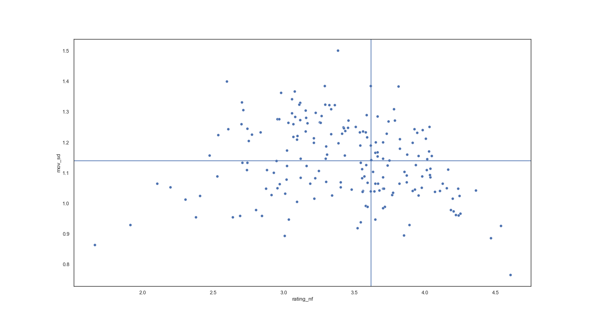

# Business Analytics MVP
Peter Goff

Netflix needs to expand their offerings to viewers, which means making decisions on which movies & shows to integrate into their catalogue. Anime has a strong viewership base in Asia and modest and 
[growing viewership among Western viewers](https://www.grandviewresearch.com/industry-analysis/anime-market). Exploration of expansion into the anime market seems timely. 

One challenge in the acquisition of movies and shows lies in making out-of-sector recommendations for viewers who have not seen - and therefore have not rated - these selections. A potential solution to this challenge lies in the integration of an external data-source that contains rated media within the Netflix library and media beyond the Netflix library. By linking movies across these databases, I can identify how ratings among the sub-section of anime movies within the Netflix catalogue correspond to those beyond the catalogue.  

The challenge at this point lies in reconciling rating differences. The Anime Movie Database is populated by anime enthusiasts, who may well have different tastes and preferences than the do general Netflix viewers (picture the rating differences between audience ratings and critic ratings on [Rotten Tomatoes](https://www.rottentomatoes.com/about)).  
Ideally, I would like to build a clustering model using NLP movie/show descriptions coupled with salient movie/show variables. This approach would allow me to take movies that are highly rated by Netflix and provide out-of-catalogue recommendations based on similar movies within the same cluster. Such an approach would avoid a naive recommendation of all highly-rated movies from the Anime Movie Database.  

Lastly, the person-level data of the Netflix database can be further leveraged by modeling alignment between external ratings and their own ratings. Netflix viewers with a strong alignment between their ratings of anime media and those from the Anime Movie Database could be identified - counted and described. More importantly, recommendations for these individuals can be directly informed by ratings from the Anime Movie Database.  

For those viewers whose tastes diverge from anime cannon, we can again draw from the clustering model to select movies/shows that, although having low-ratings from the Anime Movie Database, are apt to be appealing to this segment of viewers.  
In sum, this project will (a) provide descriptive overview of anime viewership within Netflix, (b) facilitate the selection of out-of-sample anime media, and (c) inform recommendations of out-of-sample shows across a latent, heterogenous anime viewership.

Using standard deviation of rating acoss viewers as a measure of (dis)agreement (on the y-axis) and aggregated media rating (on the x-axis), we can identify offerings from the current Netflix catalogue that demonstrate high agreement with respect to their high rating (data points in the lower right) and those that demonstrate high agreement with respect to their low ratings (those in the lower left). Using genre tags associated with each data point, we identify genres that are over-represented in each sector. Through this approach we can find that generes such as horror, terror, and vampirism are well received by the Netflix community. Similarly, media categorized as sports, historic, music, or samurai are comparatively less appreciated.
