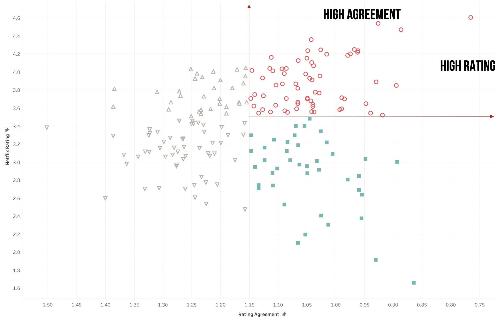
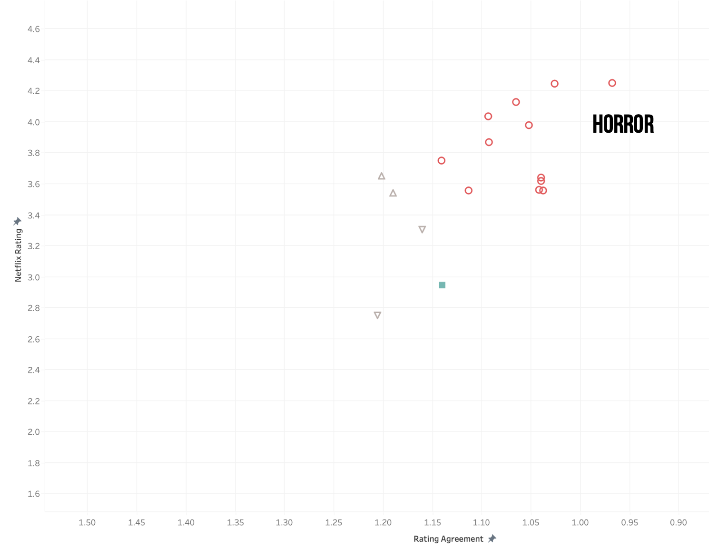

# Expanding the Netflix anime cagalogue: A proposal to capitalize on a growing market
Peter Goff

## Abstract
Netflix needs to continually expand their offerings to viewers, which means making decisions on which movies & shows to integrate into their catalogue. Anime has a strong viewership base in Asia and modest and a
[growing viewership among Western viewers](https://www.grandviewresearch.com/industry-analysis/anime-market). An exploration of expansion into the anime market is timely and likely profitable. In this proposal I have set forth a plan to recommend media for incorporation into the Netflix cataloge. Preliminary analyses have shown that a focus on current Netflix anime offerings that are both highly rated and demonstate high agreement of these ratings is viable. The graphic below shows a scatterplot of rating versus agreement. Media with the high-rating and high-agreement characteristics that we would like to identify in out-of-sample media are shown in red.

Using features that are associated with each movie or show, such as genre, we can determine sets of features that predict whether or not a movie or show will be highly rated with high-agreement. The graphic below, for example, shows that anime in the horror genre is a defining feature of this group. Using Natural Langauage Processing (NLP) techniques we can extract further information narrative movie summaries to expand and refine our predictive power.

## Design
One challenge in the acquisition of movies and shows lies in making out-of-sector recommendations for viewers who have not seen - and therefore have not rated - these selections. A potential solution to this challenge lies in the integration of an external data-source that contains rated media within the Netflix library and media beyond the Netflix library.

## Data,
* [User-level Netflix data](https://www.kaggle.com/netflix-inc/netflix-prize-data) is available through Kaggle (updated 2020).
* [Movie-level Anime data](https://www.kaggle.com/thomaskonstantin/top-10000-anime-movies-ovas-and-tvshows) contains the top 10,000 anime movies and shows with a short synoposis for each record. 
* [User-level Anime data](https://www.kaggle.com/CooperUnion/anime-recommendations-database) contains data from 73,516 users on 12,294 anime movies/shows along with genere tags.

All three databases are available for download and can be linked via the movie/show name.

## Algorithms
* Additional movie-based based features (e.g., MPA ratings, release dates) will be added to the existing databases via webscraping with beautifulsoup (and Selenium, as needed). 
* Exploratory data analysis, including descriptive analysis via data visualization, will expand upon the work started here. 
* Synopsis topics will be constructed using principal components analysis (PCA) with verimax-rotation and contrasted with measures constructed through correlated topic modeling (CTM).
* Synopsis topics, genres, MPA ratints, release dates, and all other features will be integrated into a classification model. The classification model target will be measures of anime media currently in the Netflix catalogue that are (a) rated above average and (b) have high agreement as to that rating (sub-average rating standard deviations). 
* Feature engineering, model specification, and hyper-parameter tuning will provide a final model that can be applied to the external anime databases. This process will generate predicted targets - anime features that are predicted to be highly rated with high agreement among existing Netflix customers. 
* Concurrently, these features will be integrated into a content-based recommender alogrithm. The media that are recommended via the recommender process will be cross-referenced against media that emerge from the classification models. Those that receive the highest metrics from both systems will be moved forward for final consideration.

## Tools
Using an Agile-based project-managment approach, my team will use a combination of Python, Excel, and Tableau to 
*  Expand   Netflix data through 2021
*  Identify   successful anime offerings within the Netflix catalogue
*  Combine   with external databases to Extract key characteristics
*  Build   a classification model to create a set of defining measures
    * Including synopsis topics generated via correlated topic modeling
*  Apply   these measures to a content-based recommender
*  Recommend   out-of-sample anime movies for inclusion in Netflix catalogue
*  Collaborate   with finance & procurement for cost-effective recommendations

## Communication
All findings and insights, beyond those set forth in the propoposal documents, will be kept confidential and viewable only to authorized Netflix leadership.